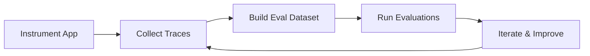

Evaluation is critical for maintaining AI quality in production. Heroku provides comprehensive evaluation capabilities through observability integrations that help you trace, debug, and improve your AI applications.

## Why Evaluation Matters

Building AI applications is iterative. Evaluation helps you:

- **Track model performance** over time and across versions
- **Catch regressions** before they impact users
- **Compare prompts and models** to find the best approach
- **Debug unexpected behaviors** with full request/response visibility
- **Build confidence** before deploying changes to production

## Evaluation Approaches on Heroku

Heroku integrates with leading observability platforms that provide evaluation capabilities tailored for LLM applications.

### Tracing with Arize Phoenix

Capture every LLM call with full request/response payloads for post-hoc analysis. Phoenix provides:

- Automatic trace collection with OpenTelemetry
- LLM-as-a-judge evaluations for quality scoring
- Dataset management for building evaluation sets
- Visual debugging of multi-step agent workflows

### Experiment Tracking with W&B Weave

Run experiments on prompts and compare model performance across versions:

- Track prompt iterations and model configurations
- Compare outputs side-by-side
- Log custom metrics and evaluations
- Collaborate with your team on improvements

### Production Monitoring with Logfire

Set up comprehensive observability for production workloads:

- Real-time error tracking and alerts
- Latency percentiles (p50, p95, p99)
- Token usage and cost monitoring
- Structured logging for LLM calls

## Getting Started

Choose an observability tool based on your needs:

<CardGroup cols={3}>
  <Card title="Arize Phoenix" href="/ai-integrations/arize-phoenix" icon="chart-line">
    Full tracing and LLM evaluation
  </Card>
  <Card title="W&B Weave" href="/ai-integrations/wandb-weave" icon="flask">
    Experiment tracking and comparison
  </Card>
  <Card title="Logfire" href="/ai-integrations/logfire" icon="fire">
    Production observability
  </Card>
</CardGroup>

## Evaluation Workflow

A typical evaluation workflow on Heroku follows these steps:

1. **Instrument your application** with tracing (Phoenix, Weave, or Logfire)
2. **Collect traces** from development and production
3. **Build evaluation datasets** from interesting cases
4. **Run evaluations** to measure quality metrics
5. **Iterate and improve** prompts, then repeat

## Next Steps

- [Set up Arize Phoenix](/ai-integrations/arize-phoenix) for comprehensive tracing
- Review [Evaluation Best Practices](/evaluation/best-practices) for guidance on building effective evals
- Explore [Prompt Patterns](/cookbook/prompt-patterns) to improve your prompts
